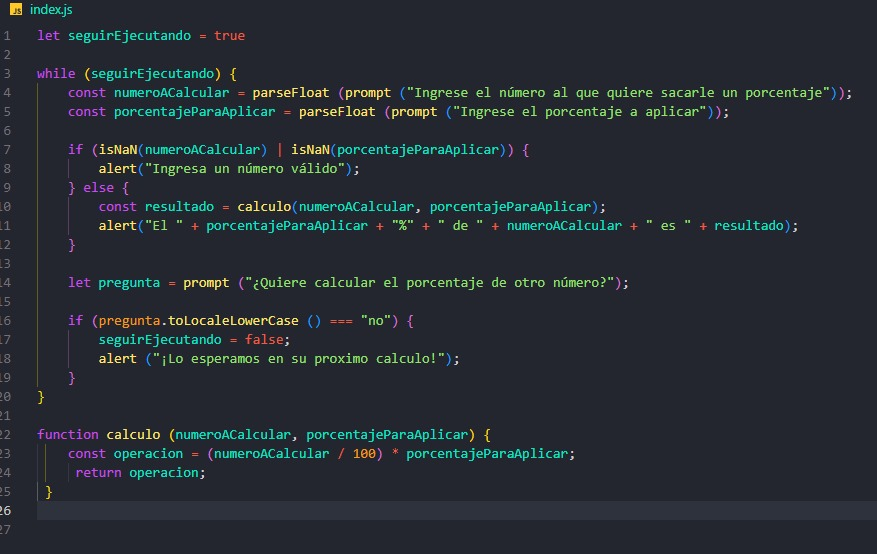
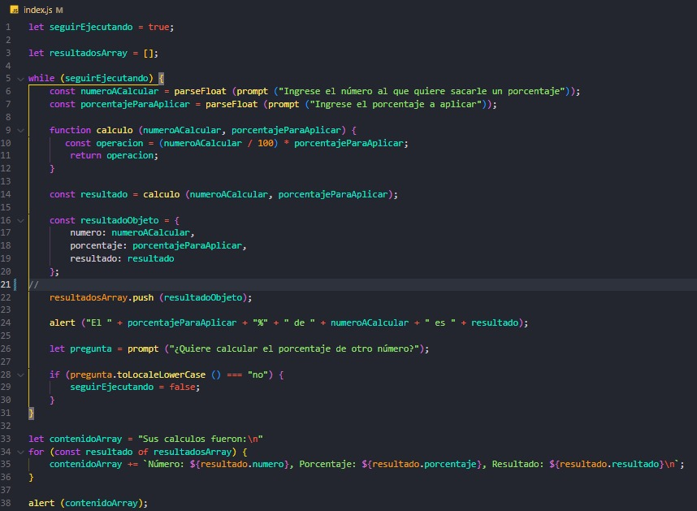
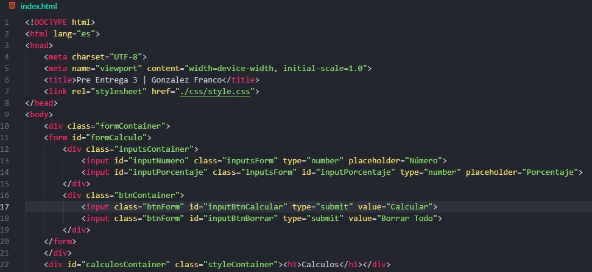
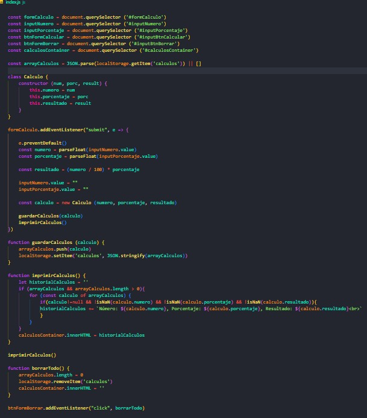
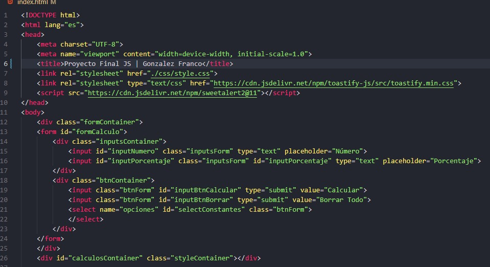
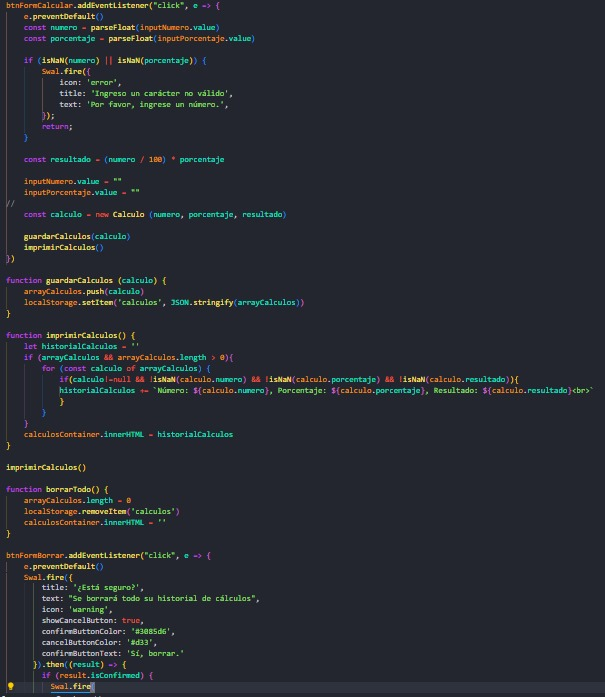

Proyecto Final Gonzalez Franco

Link del repo: https://github.com/francolgonzalez/ProyectoFinalJsGonzalezFranco

Link del deploy: https://francolgonzalez.github.io/ProyectoFinalJsGonzalezFranco/

El proyecto que hice es una calculadora de porcentajes. A medida que fueron pasando las pre entregas, le fui agregando funcionalidades, estilos y detalles.

En la primera pre entrega, la calculadora era más que sencilla 😂. Tenía un HTML que solo tenía enlazado el JS; obviamente, no tenía CSS y tenía un código JS que dejaba bastante que desear 🥴.

Con una primera entrega que cumplía, pero no destacaba, llegó una segunda entrega, que siguió el camino de la primera 🫡. Esta segunda entrega agregaba más funcionalidades como un array en el que se iban guardando los cálculos. Cuando el usuario no quería hacer más cálculos, se imprimían en pantalla todos los cálculos que había hecho. Aunque agregaba alguna funcionalidad extra en comparación con la primera entrega, la segunda seguía dejando un poco que desear 🤓.

Las clases fueron pasando y llegamos por fin a la Tercera Pre Entrega, y la cosa se empezó a poner buena. Agregamos un HTML con un formulario con inputs y un contenedor para guardar los resultados. Le aplicamos estilo con CSS y agregamos funcionalidad en JS, como un botón para realizar el cálculo y otro para borrar el historial de cálculos. También creamos un constructor con el número, porcentaje y resultado, y algunas funciones. En esta Tercera Pre Entrega, hubo un cambio drástico en el proyecto; se agregaron tanto funcionalidades como un HTML y CSS, y la calculadora tomó color 🚀🦾.

Llegamos al Proyecto Final, la Tercera Pre Entrega había quedado bastante completa desde mi punto de vista. Por el tipo de proyecto, no había mucho más que agregar. Di varias vueltas para ver qué podía hacer para aplicar lo necesario para esta última etapa, y con la ayuda del docente, quien me dio la idea, para esta última entrega del proyecto decidí hacer un JSON con constantes como pi, phi, e y g. En el HTML agregamos un select, y en el JS, traímos la información guardada en el JSON. Creamos "options" con los valores del JSON y agregamos un evento "change" al select para que se guarde en el input "porcentaje" el valor que el usuario elegía 💻😋.

De esta manera, damos por terminado el curso de JavaScript en Coder House, un muy buen curso que me deja muchos aprendizajes. Agradezco al docente y a los tutores por todo el esfuerzo y enseñanzas 🥰.